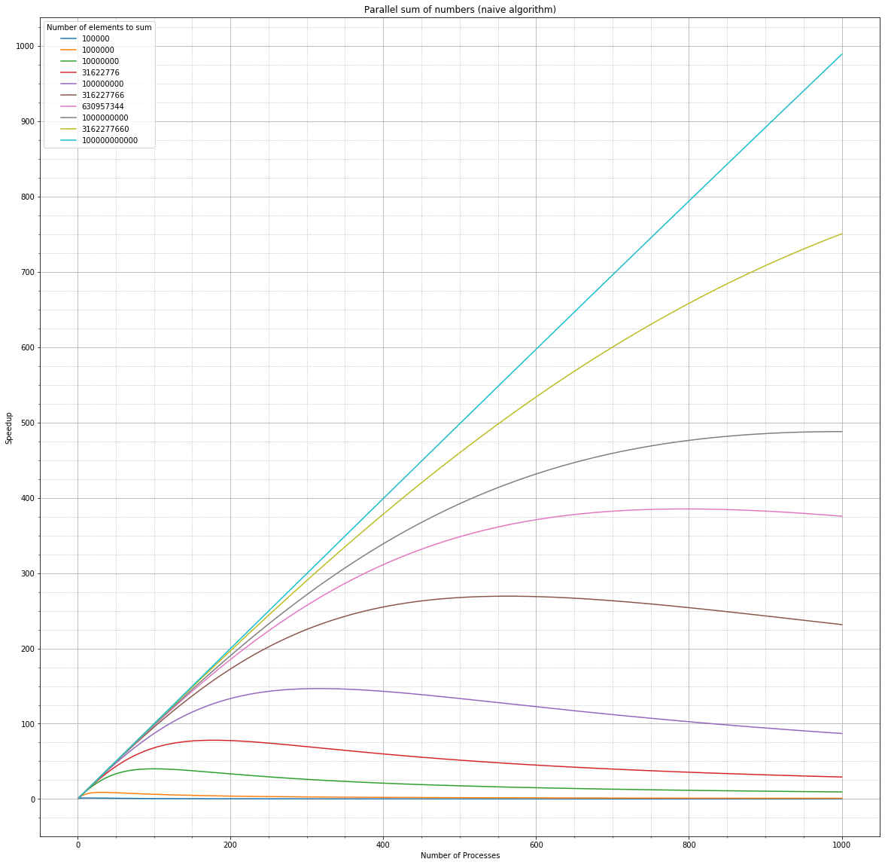
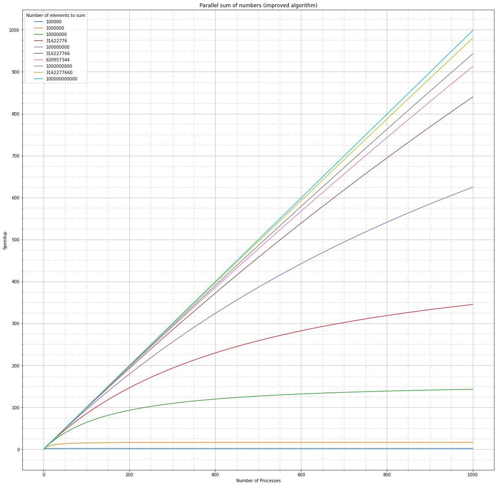
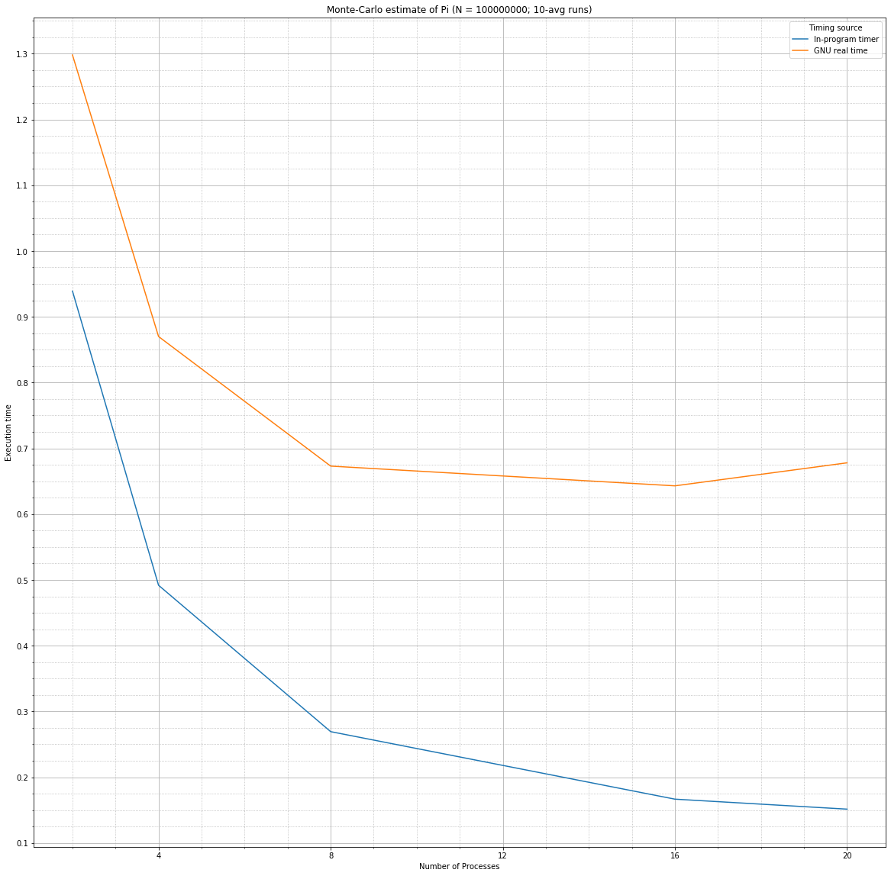
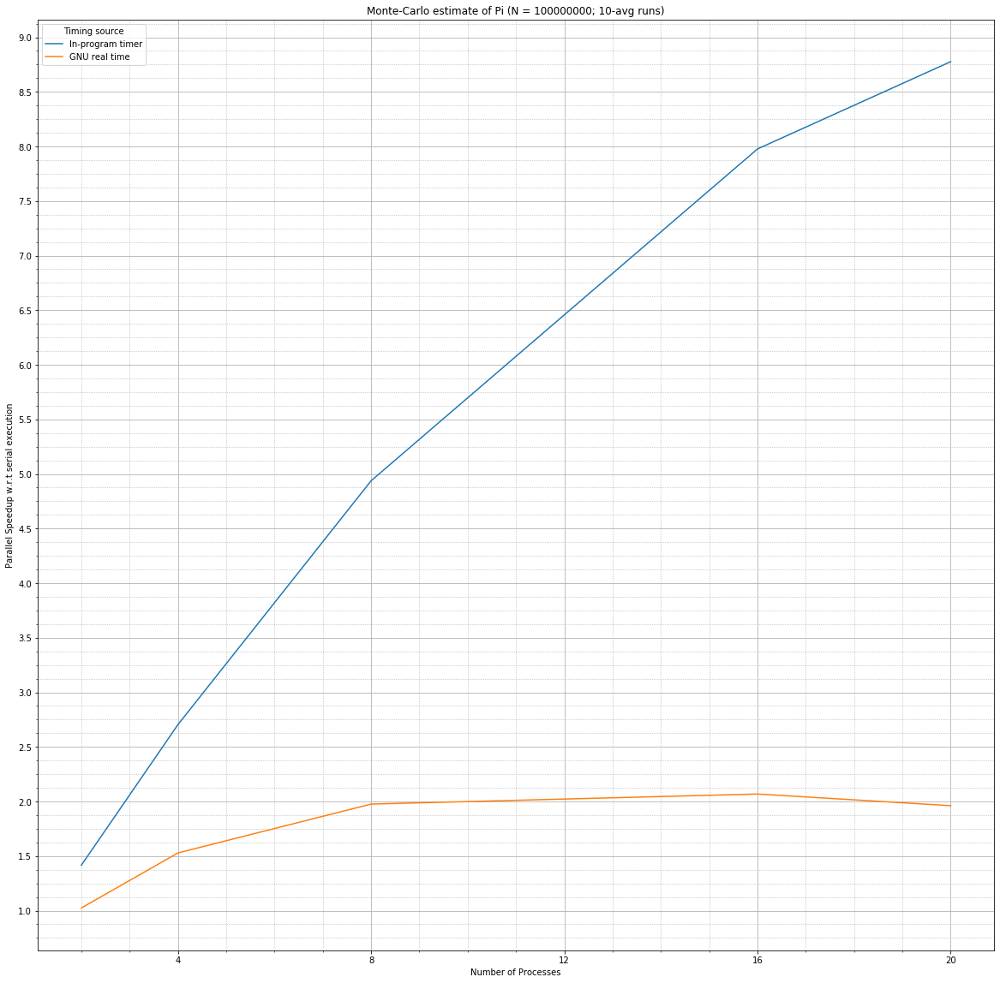
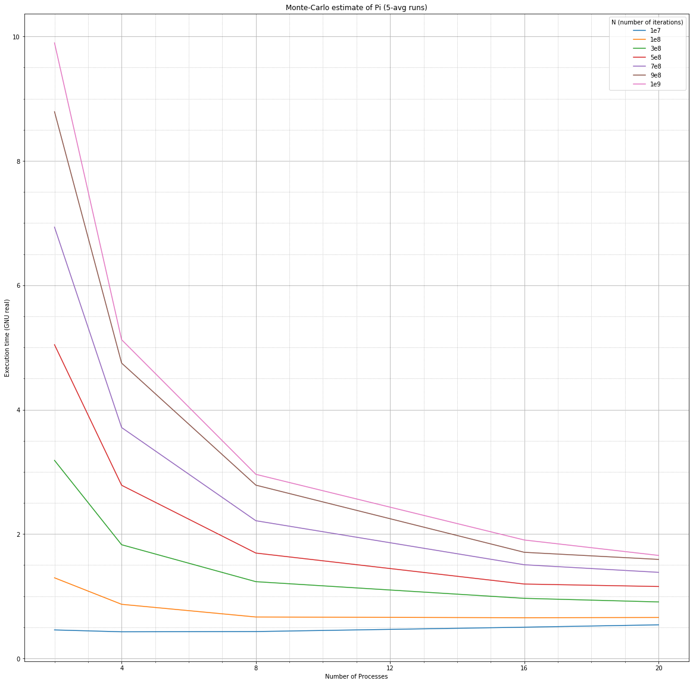
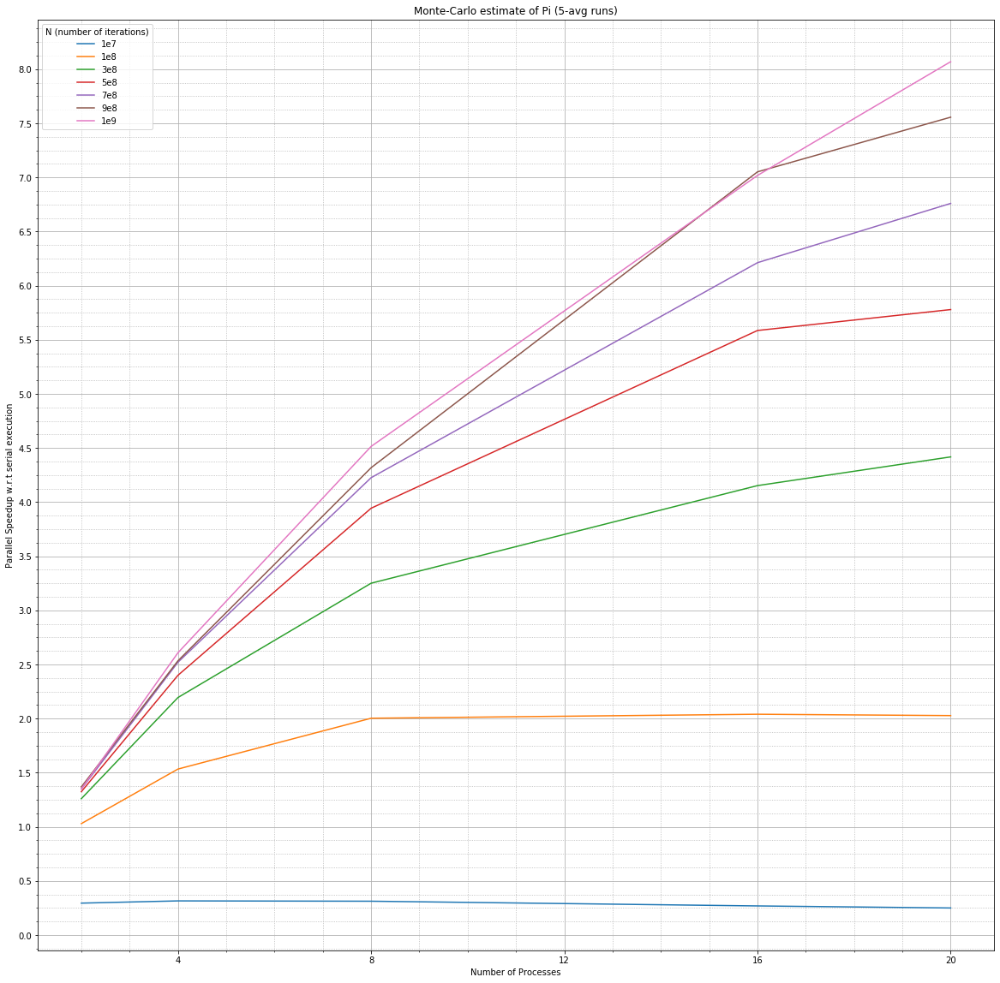
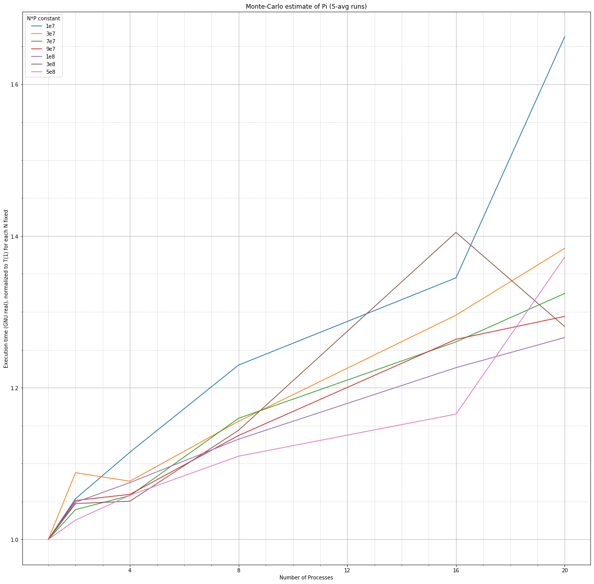
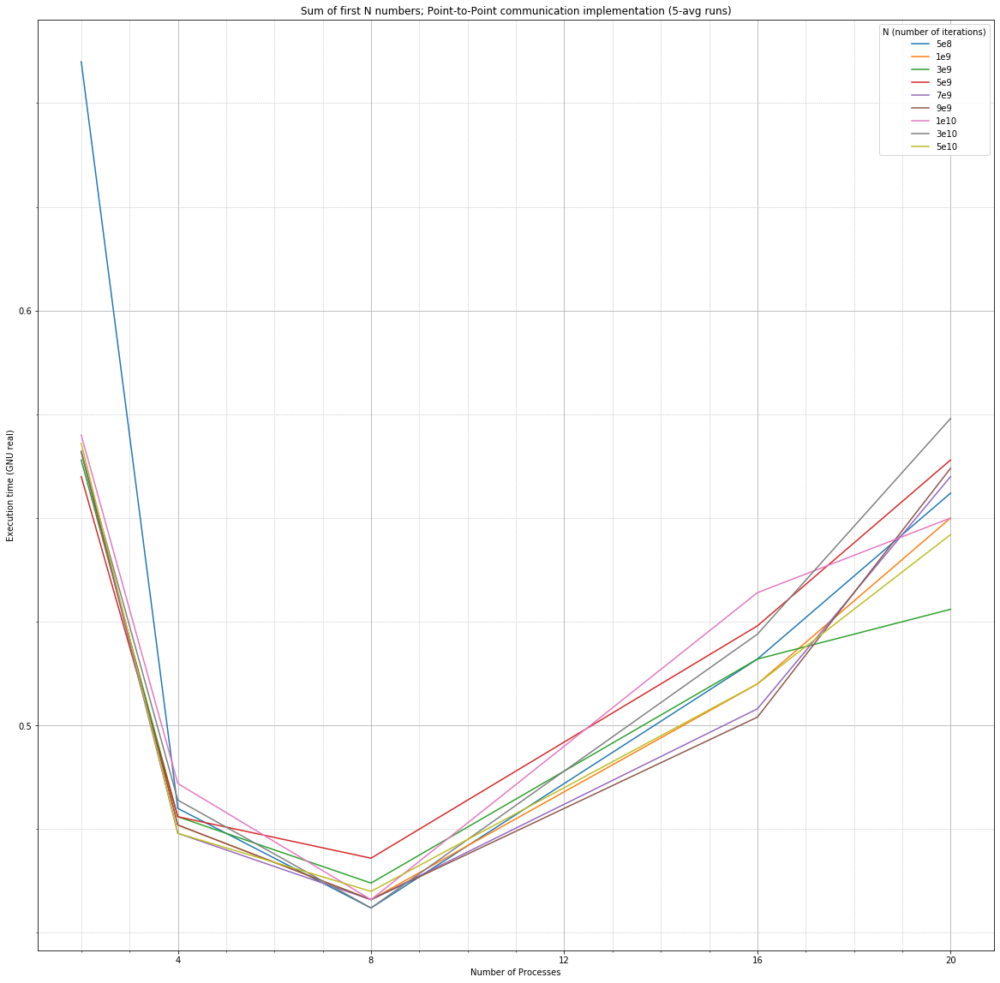
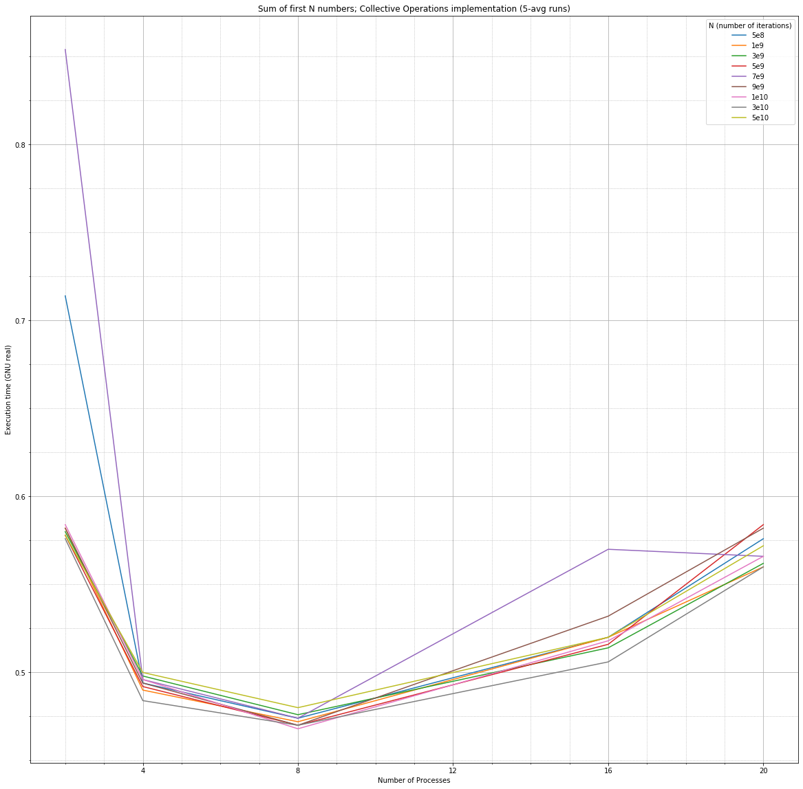

# [First Assigment](https://github.com/emaballarin/fhpc_assignments_2019-2020/tree/master/A01) - *FHPC course (2019/20)*

### Submitted by: <u>[Emanuele Ballarin](mailto:emanuele@ballarin.cc)</u>

***Tracking [assignment text version 1.2](https://github.com/sissa/FHPC_2019-2020/blob/86959bd3d32ef061f1f9bde3b82544ba5b32f33f/Assignements/Assignement01.md) (released: 04.11.2019 @ 18.30 CEST)***

The following essay, submitted in fulfilment of the requirements for the *Foundations of High Performance Computing* course (academic year 2019/2020), has the concepts – and their study – of *performance measurement* and *scalability* at its core. 

Tasks spanning the evaluation of different computing systems according to common performance metrics, the devise of theoretical models for serial and parallel execution, the evaluation of such models against experimental data obtained from purposedly-written codes executed on supercomputing nodes, and the design and implementation of such codes will be performed and discussed. Particular emphasis will be put on the relationship between acquired data and their theoretical explanatory underpinnings, with the final goals of improving and optimizing execution speed of HPC/HPAI codes while avoiding resource overallocation, and identifying the major bottlenecks that prevent perfect (or, in some cases, *good*) scalability of such codes.

---

## Section 0: Warm-up

### Computing the theoretical peak performance of a laptop

In order to compute the theoretical peak performance of a laptop (or, without loss of generality, any single-motherboard computer whose eventual additional *computing accelerators* will be ignored) it is first necessary to gather some specific information about its CPU(s).

In the specific case of a multi-core, single-processor laptop running Linux and equipped with a `bash` shell, the following information has been obtained:

|     Required information      | How / from where it has been obtained / why \| Commands executed |
| :---------------------------: | :----------------------------------------------------------- |
|           CPU model           | From laptop manufacturer’s documentation or – equivalently – from the `bash` command `cat /proc/cpuinfo | grep -m1 name`. |
|   CPU frequency (one core)    | From CPU manufacturer’s documentation, given the model name already obtained, or just from the same `bash` command as before `cat /proc/cpuinfo | grep -m1 name`. The usage of `/proc/cpuinfo`-provided information about clock frequency has to be avoided due to the fact that it is the kernel-reported frequency – and as such is representative of current clock frequency (influenced by current system load, power consumption management profiles, number of active cores, hyperthreading, …) and may be different among cores/threads. |
|      Number of CPU cores      | From CPU manufacturer’s documentation, given the model name already obtained, or from the `bash` command `cat /proc/cpuinfo | grep -m1 cores`. |
| Number of FLOPs / cycle (F64) | [This Wikipedia table](https://en.wikipedia.org/wiki/FLOPS#FLOPs_per_cycle_for_various_processors), which is user-contributed, provides adequate information about the number of floating point (here and in the following, F64 – i.e. double precision – will be assumed) operations per cycle (FLOPs/cycle). However, this number can be further explained by analyzing the hardware design of the specific CPU. As an example – for the current specific case of a *Skylake client* CPU (among others) – [Dr. John McCalpin](https://www.tacc.utexas.edu/about/directory/john-mccalpin) from TACC provides an accurate breakdown of the hardware implementation details contributing to that number [in a popular thread in Intel Developer Zone community](https://software.intel.com/en-us/forums/software-tuning-performance-optimization-platform-monitoring/topic/761046). |

As a final result, for the specific case, all the information acquired can be summarized as such:

|        |        Model        |                   CPU                   |    Frequency    | Number of cores | F64 ops/cycle | Peak performance |
| :----: | :-----------------: | :-------------------------------------: | :-------------: | :-------------: | :-----------: | :--------------: |
| Laptop | Dell Precision 7510 | Intel Core i7-6820HQ (*Skylake client*) | 2.70 GHz (base) |        4        |      16       |  172.8 GFLOPs/s  |

In the table above, the *theoretical peak performance* constitutes an upper bound to the actual sustained F64 peak performance of the machine, which is more diffecult to estimate and requires the execution of a specific benchmarking suite, and has been obtained as follows:

$Peak\ performance\ [FLOPs/s] = Number\ of \ cores \times Frequency\ of\ a\ core\ [Hz] \times Number\ of\ floating\ point\ operations\ per\ second\ =$

$= 4 \times (2.7 \times 10^9) \times 16 = 172.8 \times10^9 FLOPs/s$

### Computing the theoretical peak performance of a smartphone / tablet

In order to compute the theoretical peak performance of a smartphone or tablet (in the specific case: an Android tablet), the same information as in the laptop case need to be obtained. In this case, however, given the lack of a `bash` shell or programmatic access to kernel APIs, reliance on manufacturer information and/or dedicated applications is required.

|     Required information      | How / from where it has been obtained                        |
| :---------------------------: | :----------------------------------------------------------- |
|           CPU model           | From tablet manufacturer’s documentation or – equivalently – from dedicated system information applications (in the specific case: [AIDA64](https://play.google.com/store/apps/details?id=com.finalwire.aida64)). |
|   CPU frequency (one core)    | From tablet manufacturer’s documentation or – equivalently – from dedicated system information applications (in the specific case: [AIDA64](https://play.google.com/store/apps/details?id=com.finalwire.aida64)). |
|      Number of CPU cores      | From tablet manufacturer’s documentation or – equivalently – from dedicated system information applications (in the specific case: [AIDA64](https://play.google.com/store/apps/details?id=com.finalwire.aida64)). |
| Number of FLOPs / cycle (F64) | From the already mentioned, user-contributed, [Wikipedia table](https://en.wikipedia.org/wiki/FLOPS#FLOPs_per_cycle_for_various_processors). |

Which gives:

|        |          Model           |                     CPU                     |               Frequency               | Number of cores | F64 ops/cycle | Peak performance |
| :----: | :----------------------: | :-----------------------------------------: | :-----------------------------------: | :-------------: | :-----------: | :--------------: |
| Tablet | Galaxy Tab A 10.1 (2016) | Cortex-A53 (4 cores) + Cortex-A53 (4 cores) | 1.6 GHz (4 cores) + 1.0 GHz (4 cores) |  8 (as 4 + 4)   |   2 (both)    |  20.8 GFLOPs/s   |

Also in this case, the theoretical peak performance has been obtained as follows – which is a variant of the previous, that just accounts for multiple processors on the same device:

$Peak\ performance\ [FLOPs/s] = \sum_{(every\ proc.)} Number\ of \ cores \times Frequency\ of\ a\ core\ [Hz] \times Number\ of\ floating\ point\ operations\ per\ second\ =$

$= 4 \times (1.6 \times 10^9) \times 2 + 4 \times (1.0 \times 10^9) \times 2  = 20.8 \times10^9 FLOPs/s$

### Computing the sustained peak performance of a smartphone / tablet

For the task of evaluating the sustained peak performance of a smartphone or tablet (in the specific case: an Android tablet), the use of dedicated benchmarking applications is required. In this case, given the relatively low impact of processor-specific optimizations – often typical of benchmarking suites that require compilation from source –, a benchmarking application in binary form and [available from the *Play Store*](https://play.google.com/store/apps/details?id=com.sqi.linpackbenchmark) has been used.

In the specific case, the application - developed and distributed by the [*Research Computing Center*](https://rcc.msu.ru/en) of the Lomonosov Moscow State University - implements for the Android platform a slight modification of the traditional [*High Performance Linpack*](https://www.netlib.org/benchmark/hpl/) benchmark.

In order to select the matrix size that leads to the highest possible result, multiple automated runs (by means of in-application automation) have been performed. The best result is summarized below.

|        |          Model           | Sustained performance | Size of matrix | Memory size |
| :----: | :----------------------: | :-------------------: | :------------: | :---------: |
| Tablet | Galaxy Tab A 10.1 (2016) |    735.27 MFLOPs/s    |      2675      |    2 GB     |

### Comparison to historical TOP500 results

From the results outlined above, it is possible to perform a comparison between those performance metrics relative to a modern-day laptop or tablet, and the historical entries in the *TOP500* list, which gathers – in a bi-yearly chart – the 500 best-performing supercomputing systems of the World. The last year at which (if possible) the modern-day device would have been among the first entries of the TOP500 chart has been considered for the comparison.

|        |          Model           |          Performance (theor. peak)           | TOP500 year |         Nr. 1 HPC system          |            Number of processors (TOP500@1)             |
| :----: | :----------------------: | :------------------------------------------: | :---------: | :-------------------------------: | :----------------------------------------------------: |
| Tablet | Galaxy Tab A 10.1 (2016) | 735.27 MFLOPs/s Rpeak (20.8 GFLOPS/s theor.) |    1993     | Thinking Machines Corp. CM-5/1024 | 1,024 @ 59.7 GFLOPs/s *Rmax* \| 131.0 GFLOPs/s *Rpeak* |
| Laptop |   Dell Precision 7510    |            172.8 GFLOPS/s theor.             | 1994 (june) |           Intel XP/S140           | 3680 @ 143.4 GFLOPs/s *Rmax* \| 184.0 GFLOPs/s *Rpeak* |

---

## Section  1: Theoretical performance model

In the following section, we will focus our analysis on a naive “toy” algorithm to perform the sum of N numbers, specified for both serial (single-process) and parallel execution, and we will compare the two in order to gain some theoretical insights on the scalability of such algorithm.

### Serial execution

Assuming as a starting point the situation in which all the numbers ($N$, in total) are already in memory, the algorithm just consists in performing the sum of such numbers, which means performing $N-1$ floating point operations.

Calling $T_{comp}$ the time required to perform a floating point operation (in this case, a sum), the total time required by the serial algorithm to complete its task is $T_s = (N-1) \times T_{comp}$.

### Parallel execution

To attack the problem of summing numbers in a parallel – making use of $P$ different processes – and eventually distributed fashion, a naive *Master-Slave* algorithm can be devised:

-   The *Master* **reads** the number of elements (numbers) to be summed from a textfile;
-   The *Master* **sends** such number to the remaining *Slave* nodes (which are $P-1$), serially;
-   Each process (either *Master* or *Slave*) **computes** the partial sum of a specific subset of the initial $N$ numbers;
-   Each *Slave* **sends** to the *Master* the result of the partial sum (and the *Master* receives them serially);
-   The *Master* **computes** the sum of the $P-1$ results received.

If we assume that the compute workload is distributed evenly among *Master* and each *Slave*, that the particular numbers to be summed by each process are already in memory for each process (or can easily be computed in-process, in an amout of time we can ignore) and that each **read**, **send** and **sum** operation happens in the same amount of  time regardless of the number(s) to be read/summed/sent or the *Slave* which performs the send/receive operation – respectively $T_{read}$, $T_{comm}$ and $T_{comp}$ (which is the same as in the serial model) – the total amount of time required to complete the task in parallel can be estimated as: $T_p = T_{comp} \times (P - 1 + N/P)  + T_{read} + 2(P-1)\times T_{comm}$.

### *Parallel speedup* and scalability curves

From these, one can compute the *parallel speedup* of the algorithm versus its serial counterpart, defined as $S(N, P) = T_s(N)/T_p(N,P)$.

In order to study theoretically the scalability of such algorithm, we need to make some additional assumptions, in particular about the specific times required by the **read**, **send** and **sum** operations. As such (in seconds):

- $T_{comp} = 2 \times 10^{-9}$
- $T_{read} = 1 \times 10^{-4}$
- $T_{comm} = 1 \times 10^{-6}$

At this point, we can compute and plot the so-called *scalability curves*, that describe how the *parallel speedup* varies as a result of different values (or variations) of $N$ and $P$.

### On scalability and scalability curves

By looking at the plot above, it is possible to infer some theoretical properties of the algorithm with regards to its scalability, i.e. – in this case – its ability to increase its speedup proportionally to the number of processors dedicated to the problem (and which is a function of the problem size).

In particular, referring to the case here discussed, we say that the algorithm *scales* for a given number of elements to sum $N$, if an increase in processes $P$ parallelly solving the problem results in a likewise increase in speedup with regard to the serial execution (a so-called *linear* or *perfect* speedup).

Looking at the plot (which has been specifically made with this goal in mind) it is possible to notice that the light blue, almost-straight line corresponding to $10^{11}$ elements to be summed constitutes a good example of scalability (and, by construction of the plot, it is the line with this property at the lowest value of $N$). This means that the algorithm analyzed *scales well* for any value of $N \geq 10^{11}$. For lower values of $N$, the algorithm shows a worse scalability.

By considering the problem size fixed and just looking at which number of processes $P$, the algorithm achieves the best speedup for every $N$ given, we can further partition the space of $N$s. For $N \geq 10^{9}$, the highest number of processors considered in this analysis (i.e. $P = 1000$) also produces the highest speedup; for $N < 10^{9}$ this is no longer true and such value of $P$ decreases with a decrease in the problem size. This is summarized in the table below.

| Number of elements to sum (N) | Number of processors (P) producing the maximum speedup |
| :---------------------------- | :----------------------------------------------------- |
| 100000                        | 9                                                      |
| 1000000                       | 31                                                     |
| 10000000                      | 99                                                     |
| 31622776                      | 177                                                    |
| 100000000                     | 315                                                    |
| 316227766                     | 562                                                    |
| 630957344                     | 794                                                    |
| 1000000000                    | 1000                                                   |
| 3162277660                    | 1000                                                   |
| 100000000000                  | 1000                                                   |

### A modest proposal to improve scalability

We are interested here is trying to devise a better parallel algorithm that *scales well* even for a smaller problem size and that – as a result, for smaller sizes too – reaches the maximum speedup for a higher number of processes compared to the naive version of the algorithm analyzed till now, thus allowing for a more efficient use of available computational resources.

By comparing $T_{read}$, $T_{comm}$ and $T_{comp}$, and the expression for $T_p$ given above, it is clear that $T_{read}$ is the highest *atomic operation* time, but it is unavoidable and impacts the final time balance only once. By contrast, $T_{comm} \gg T_{comp}$ and also serial send/receive from/to the *Master* constitutes a major bottleneck in the parallel execution of the algorithm. What would be positive, to improve the overall scalability of the algorithm, is to trade-off a slight increase in the number of computations for a more parallel approach to communication among processes.

This can be obtained by the means of *communication parallelization*: 

-   The *Master* **reads** the number of elements (numbers) to be summed;
-   Until such number has been propagated to every *Slave*:
    -   Every process that *already has received/read* such number **sends** it to *one* other process (until completion);
-   Each process (either *Master* or *Slave*) **computes** the partial sum of a specific subset of the initial $N$ numbers;
-   Until just *one* process (the *Master*) remains:
    -   Processes are split in half;
    -   Processes on one half **send** the result of their partial sum to one (different among them) of the other half (which always contains the *Master*);
    -   Receiving processes (eventually) **compute** the sum of the two numbers obtained (own and received);
-   The *Master* **computes** the sum of the *two* results finally obtained (which is just a specification of the previous step).

By estimating the time required to complete the parallel send at the beginning and the parallel receive at the end for a $P$ that is an exact power of $2$, this leads to an improved parallel execution time of $T_p = T_{comp} \times (N/P) + T_{read} + 2 \log{_2}{(P)} \times (T_{comm} + T_{comp}) $, which always results in a lower (or equal) parallel execution time when compared to the original version of the parallel algorithm.

This result is particularly evident when comparing the scalability curves and the table of maxima for this algorithm, with the ones shown before.

| Number of elements to sum (N) | Number of processors (P) at maximum speedup |
| :---------------------------- | :------------------------------------------ |
| 100000                        | 68                                          |
| 1000000                       | 691                                         |
| 10000000                      | 1000                                        |
| 31622776                      | 1000                                        |
| 100000000                     | 1000                                        |
| 316227766                     | 1000                                        |
| 630957344                     | 1000                                        |
| 1000000000                    | 1000                                        |
| 3162277660                    | 1000                                        |
| 100000000000                  | 1000                                        |

---

## Section 2 : Playing with the MPI program

In this section, we will focus our analysis on the algorithmic task of computing the value of the mathematical constant $\pi$ by means of *Monte-Carlo* integration. A serial program (`pi.c`) and an MPI-parallel one (`mpi_pi.c`) implementing a possible version of the algorithm are provided. These same codes has been used in the following sections, with just minor modifications to make their output more tractable by data acquisition and analysis machinery referred to below.

In the specific case, two numbers – representing the $x$ and $y$ coordinates of a point in a 2D plane – are sampled from a uniform distribution in the range $[0,1]$. It is then checked if the corresponding point would belong to the quarter-circle of radius $r=1$ and center $(0,0)$ inscribed in the $[0,1]\times[0,1]$ square. By iterating the procedure and computing the ratio between the number of points inside the circle and their total number, an estimate of $\pi/4$ can be made. The programs, then, multiply such ratio by $4$ and outputs an estimate of $\pi$ which is more accurate as the number of sampled points (or *stone throws*, by an effective analogy) increases.

Except when otherwise noted, all the executions referred to are considered to have been run on one node (20 available cores, in total) part of the *Ulysses* supercomputing cluster, located at the *SISSA/ICTP Supercomputing Centre*, Trieste, Italy.

### 2.0:  On data acquisition and the *right choice of timing*

In the following sections, the need to automate runs and *timed* runs of both serial and parallel programs – and to perform some analysis on timing data and on the output of the programs (which is timing data, too) – arises. In addition to that, it is crucial to determine which specific time metric to use when comparing the execution time of programs.

To accomplish the first goal, some Python scripts making use of the `subprocess` module and some functional abstractions – which are then able to call binaries and shell commands, to provide high-level programmatic access to operations such as *timed* and *non-timed*, serial and MPI-parallel executions, and to collect the eventual timing data produced – have been coded and utilized.

As far as the right choice of time metric is concerned, differences between the return value of subsequent calls to C function `clock()` (contained in the `<time.h>` library) – for the serial implementation – and to C/C++ function `MPI_Wtime()` (part of standard `<mpi.h>` bindings) – for the parallel implementation – have been considered for in-program time-interval duration evaluation.

For system-level out-of-program timing, calls to GNU utility `time` have been used. In particular, the `real` time (or `elapsed` time, as reported by the utility) has been considered – being it representative of the actual time elapsed during program execution. Factors other than the actual program execution affecting such metric (e.g. system load) are of negligible magnitude in this specific case, being them the actual call(s) to `time` and (if the program exploits MPI-parallelism) the changing of `PATH`, `LD_LIBRARY_PATH` and system-wide include path which happen when calling `mpirun` (both designed to be of almost-no-impact with regards to time). They are, too, of actually measured negligible impact, and constant in duration – whichever it is, and other eventual system load is being kept at near-zero level by the means of requesting an entire single node of the HPC system on which to perform the tests.

In any case, both these choices of in-program timing and out-of-program timing are widespread inside the HPC community and are considered to be common best practices, as noted – e.g. – in *Lawrence Livermore National Laboratories*’ implementation of the `MpiP` MPI profiler.

Except when evident, or noted otherwise, the average of 10 subsequent executions of the programs – everything else constant – have been considered to be, and will be referred to as, the *execution time*. 

### 2.1.0:  Timing of the `pi.c` program

By applying the choices described before to the goal of timing the execution of the serial program `pi.c`, a result of $T_s = 1.33\ s$ has been obtained by both the in-program timer and the GNU `time` utility, for a total of 100 million *stone throws*.

In this case – as in the following other cases – the choice of a default value of $N=10^8$ *stone throws* has been made instead of the suggested $N=10^7$ in order to better compensate, with a slightly longer execution time for both the serial and the parallel version of the code, the scarce accuracy of the system timers accessible via kernel-API calls. This is a result of the lack of availability of the `HIGH_PRECISION_CLOCK` feature from the kernel, which is in turn the effect of running a *pre-3.0* Linux kernel on Ulysses (without specific patches).

### 2.1.1:  Timing of the `mpi_pi.c` program

Some *timed runs* of the MPI-parallel version of the program have been performed for the same number (100 million) of *stone throws*, using both the in-program timer – which outputs the time required by each process to complete the assigned overall task – and GNU `time`. The number of processes has been kept fixed, during these exploratory runs, at the two limiting cases: $P=1$ (a single-process execution of the MPI-parallel code) and $P=20$ (which is the total number of cores available on the requested node).

In order to cope with the fact that the in-program timer outputs a (potentially different) time interval duration per each process MPI is run with, corresponding to the process-specific execution time, it has been resolved to assume – as the effective in-program timing of the run – the maximum among output times. This choice is justified by the fact that *this* timing is more consistent with the idea of *wall-clock time* (such as the one chosen for GNU `time`), as it considers the slowest limiting factor (in this case, process) to be the one determining actual execution time.

Acquired data, for both values of $P$ and for both timing sources, is shown below.

| Run (by number of MPI processes) | Time (in-program) | Time (GNU, real) |
| :------------------------------: | :---------------: | :--------------: |
|            1 process             |      1.813 s      |      2.01 s      |
|           20 processes           |      0.489 s      |      0.86 s      |

The interesting part about these (just) two runs is that – considering what the in-program timer and the out-of-program GNU `time`r take into account (and, even more importantly, what they take not) – they provide a clear qualitative description of *MPI-parallel overhead*, which can be estimated by evaluating the difference between the two acquired times (the in-program vs. the out-of-program). In fact, it is clear that, with the increase of the number of processes, both the *compute-only* (i.e. the in-program measured) time and wall-clock time decrease (or this should, at least, be the expected behaviour). However, *MPI-parallel overhead* constitutes a larger (and larger, trying to extrapolate the trend) portion of the actual elapsed time.

### 2.1.2:  Computing and discussing the strong scalability of the `mpi_pi.c` program

Computing the *strong scalability* of an algorithm or a program means evaluating its performance – by the means of execution time – as the number of processes dedicated to solving the problem / executing the algorithm increases, while keeping problem size fixed.

In the specific case, by calling $N$ the number of stone throws in the *Monte-Carlo* algorithm, $N = 10^8$ will be kept fixed, as the number of processes increases: $P = \{2, 4 ,8, 16, 20\}$.

The graph showing program execution time (evaluated by both the means of GNU `time`‘s `real` time and in-program timer) as a function of process count $P$ is shown below.

The occurrence of *perfect linear scaling* (which means *linear* in speedup) is identified by a perfectly hyperbolic line on the graph of execution times like the one (graph, not line!) above. The constant that determines the hyperbola is difficult to estimate just by looking at the graph; for that reason, the related *scalability curves* are a better means to diagnose scalability problems of the algorithm/implementation. Such curves will be shown below.

However, from just the information immediately conveyed by the plots above, it looks clear that the in-program timer and the out-of-program one actually measure times that scale differently as the number of processors increase (being $N$ still fixed). In fact, while GNU `real` `time` measures the exact time *from start to finish* of the execution, the in-program timer just accounts for the MPI-parallel computations and communications which happen between an `MPI_Init()` and the corresponding `MPI_Finalize()`, not taking into consideration the time required e.g. to:

-   run the serial, out-of-MPI, instructions part of the program;
-   initialize the MPI machinery;
-   spawn the MPI processes.

These findings call for the adoption of GNU `real` time as the reference timing source to be used in order to evaluate the scalability of a program or implementation of an algorithm, being it more representative of *real world* scalability and taking into account also the parts of the program – which, too, affect its runtime – that are not directly controllable by an adequate choice or change of the underlying algorithm.

Also, from the same plot, it is clear that the slope of the final linear interpolant of plotted points referring to GNU `real` time – i.e. the orange linear segment in the $[16, 20]$ portion of the domain – is upswinging, in contrast with the expected (and intuitive) prediction that an increase in processes tackling a same-sized problem should always result in a reduction of computing time required to solve it. While true in theory, this intuition may easily be untrue in practice, for the concurrence of phaenomena which will be descussed in the following subsection.

Scalability curves, as referred to before, are shown below.

The plot, as expected, confirms and reinforces the findings outlined before. Neither of the timing choices (with the still present *caveat* that the in-program-obtained one is *unreal* in any case) leads to a perfectly straight line on the graph. And while the in-program scalability – which is *almost-well-behaving* – is definitely better than the out-of-program one, the latter evidences a strong lack of scalability of the overall program, with the still visible slope *inversion* in the already mentioned $[16, 20]$ interval of the $x$-axis.

In a similar fashion, it is possible to compute and plot the *execution time graph* and the *scalability curves* for the same program, for many different values of $N$ (which will still remain fixed, once chosen, for an increasing number of parallel  processes $P$ dedicated to the problem).

In the graphs that follow, the granularity of the processor number $P$ has been kept the same as before, while the different numbers of $N$ have been chosen to be $N = \{10^7,\ 10^8,\ 3\times 10^8,\ 5\times 10^8,\ 7\times 10^8,\ 9\times 10^8,\ 10^9\}$.

Given the large amount of different $N$s for a single graph plot, it is necessary to point out that in this kind of analysis the goal is to give a general overview of how strong scalability is affected (if in any way) by different problem sizes, rather than giving many accurate point-values for the specific problem. Also, the averaging for any single measurement has been reduced from $10$ to $5$ in order to speed-up data acquisition and avoid prolonged computations for what are essentially *toy experiments*.

The two graphs just mentioned are shown right below, one next to the other.

To avoid redundancy, we will comment the *execution time* and *scalability curves* graphs just shown with respect to the particular information which cannot be conveyed (and could not have been possible to analyze) by the first two graphs with $N$ fixed. Those findings, in any case, are still confirmed one time more.

As already discussed in the – that time purely theoretical – section dedicated to the sum of floating point numbers, also in this case the program implementation shows different scalability profiles as $N$ increases. In particular, while still not achievable, the *perfect linear scalability curve* constitutes sort-of an asymptotic behaviour to which the measured scalability curves seem to tend for greater and greater $N$s. In the specific case, the runs at $N=9\times10^8$ and $N = 10^9$ scale markedly better that the rest of the tries.

The curve (among those shown) corresponding to $N=3\times10^8$ seems to represent a kind of lower bound to *acceptable scalability* (again, in the overall context of the problem at hand), while the $N=10^7$ and $N=10^8$ cases are extremely-badly scaling.

To conclude the analysis contained in this subsection, it is possible to note that all the findings gathered and discussed till now – with the sole exception of the inversion in slope evident at small values of $N$ – are well aligned with the *Amdahl Law*, which is the theoretical performance model of reference for strong scalability behaviours, modulo some *corrections* accounting for the MPI-machinery overhead.

### 2.2: A *model* for the parallel overhead

In trying to tackle the problem – still remaining *unsolved* after the previous subsection – of slope inversion in both the *execution times* and *scalability curves* graphs (which are the evidence of exactly the same issue), we will address a more general aspect of parallel programming: identifying a general theoretical model to describe and in part predict – at least qualitatively – the *parallel overhead* associated to a program and its execution.

First of all, it is important to clarify that by *parallel overhead* – in accordance with one among some commonly used definitions – we denote the portion of the *execution time* of a parallel program which is determined by factors affecting program execution other than the algorithmic execution of the *ideally serial* and the *ideally parallel* part of such program, which elude as a consequence the bounds determined by the original formulation of Amdahl’s Law. As such, *parallel overhead* accounts for:

-   process-to-process communication;
-   initialization of the MPI machinery;
-   spawning, synchronization and *low-level administration* of MPI processes;
-   any other *friction* that – avoidable or not by following good engineering practices – makes the actual program behave in a less and less ideal manner.

Generally speaking, *parallel overhead* is in turn composed by both a constant part and a varying part, weakly-proportional to the number of processes.

As a modest proposal to assess *parallel overhead*, we can model the total execution time of the specific code at hand (as we can do for any code, actually) through the following breakdown of factors:

$T_p(N, P) = T_{init} + T_{spawn}(P) + T_{adm}(P) + T_{serial}(N) + T_{par}(N, P) + T_{comm}(P)$, where:

-   $T_p$ is the total execution time of the code, function of both problem size and number of processors;
-   $T_{init} \approx k_1$, approximately constant, the time necessary to initialize and start the MPI machinery (both the constant behaviour, at the variation of N and P, and the approximate value – still on a node of  the Ulysses supercomputing cluster – of $k_1 = 0.27s$ has been determined by microbenchmarking);
-   $T_{spawn} + T_{adm} \approx k_2\times P;\ k_2 \ll 1$, weakly proportional to the number of processes, the time required to spawn the MPI processes and to manage them; 
-   $T_{serial}$ and $T_{par}$, the *perfectly serial* and the *perfectly parallelizable* parts of the instruvtions of the program, which are governed by Amdahl’s Law;
-   $T_{comm} \approx k_3 \times P$ or $T_{comm} \approx k_3 \times logP$, or even $T_{comm} \approx k_3 \times P \times logP$ which accounts for a general simple (maybe simplistic?) formula to estimate communication-only overhead.

Such model, with an adequate parametrization, can be fitted on data in order to obtain specific values for the parameters, which constitute the degrees of freedom of the model.

However, noting that any sufficiently expressive model will be able to parametrize and fit arbitrarily complex data, and that [a recent publication](insert-the-right-link!) asserted and showed that probably 2 parameters suffice, we will put out focus on another property of such model we just outlined. The fact that it can explain intuitively why, for small enough values of $N$ and high enough values of $P$ the *scalability curves* for the program invert their slope.

In fact, being everything else fixed (and being the constant $T_{init}$ relevant in comparison to the compute-only time for small enough values of $N$, as said):

-   The $T_{par}$ time rapidly converges to near-zero, as predicted by the Amdahl’s Law, for a small value of $P$, usually lower than 16 for the range of $N$s exhibiting the behaviour;
-   The value of $T_{spawn} + T_{adm} + T_{comm}$ increases as $P$ increases, regardless of $N$.

It may happen that, after some value of $P$, the growth of the increasing terms outweights the effect of the decreasing terms (which, with respect to the their initial values, decrease less and less due to hyperbolic effect). After such point, scalability curves (or – likewise, but from/to the opposite trend – times) invert their slope.

### 2.3: Weak scaling

We conclude the section dedicated to the analysis of the `mpi_pi.c` program with some *weak scalability tests*. Here, *weak scalability* is defined as a propetry of a program or algorithm to maintain execution times constant if both problem size (in our case, the number of *stone throws*, $N$) and the number of processors $P$ dedicated to solving it vary while maintaining the same ratio – that is: proportionally.

If a program *scales perfectly* from a *weak* point of view, the graph plot corresponding to *execution times* vs. the number of processes ($N$ varying accordingly) should resemble a horizontal line. If *weak scaling* is not ideal, such line can instead show a positive slope as $P$ grows, meaning that – even increasing $P$ and $N$ at the same rate, an increase in the number of processes is unable to compensare the increase in problem size produced.

Weak scaling graphs – for a different initial value of $N\times P$ are shown below. As already said in the case of strong scalability, the goal here is to provide an idea if the general trend rather than to offer precise values for specific $(N\times P,\ P)$ combinations. Also in this case, the averaging of the results has been performed on 5 runs.

In order to be able to compare the different scalability profiles for such different initial values (which imply a different total running time) among each other, instead of plotting *raw* run times, the following normalized metric for *weak scalability efficiency* can be defined and plotted: $E_{weak} = T(1, N)/T(P,N)$, where:

-   $T(1, N)$ is the time required by the program to run at initial $N = N\times P$ with 1 process only;
-   $T(P,N)$ is the defined-above *weak scalability* runtime.

What we can infer from the plot, in this specific case, is that – as in the case of *strong scalability* – the program shows a definitely *less-than-ideal* *weak* scalability. Such scalability, in accordance to *Gustafson’s Law* (which is the theoretical performance model of reference for weak scalability behaviours, modulo the same *corrections* accounting for the MPI-machinery overhead) improves as the problem size increases overall (that means, the initial $N\times P$ increases) – with a clear dominance in this sense for the initial value of $N\times P = 5\times 10^8$ in the $[4,16]$ P-interval.

However – apart from the clearly *worst-scaling* behaviour for initial $N\times P = 10^7$ and the apparent outlier $(N\times P = 3\times 10^8,\ P=16)$, no clear ranking can be made, with respects to *weak scalability efficiency*, for the different initial values of $N\times P$.

## Section 3: Implementation of a parallel program using MPI

In this section we will comment the main design choices and the implementation of a simple MPI-parallel program that computes the sum of the first $N$ numbers, by following the naive algorithm shown in Section 1. The algorithm has been implemented first by the means of simple *point-to-point* communication operations, and then by exploiting MPI built-in *collective operations*. In the specific case, C++ (with MPI C *a.k.a. modern* bindings) has been chosen as the implementation language.

The *point-to-point* implementation of the program closely follows the algorithm outlined before, with the following peculiarities:

-   The number $N$ of elements to be summed is read by the *Master* node only, from a file of known path;
-   The sending/receiving operations are implemented by using the `MPI_Ssend`/`MPI_Recv` pair iterated over all the possible *Master-Slave* (and likewise *Slave-Master*) pairs. The choice of *synchronous send* – as compared to the standard `MPI_Send` (or others, for what we are concerned) – has been made solely in order to guarantee more transparent timings (by avoiding system buffering, and at the cost of slightly decreased latency) and to mirror as faithfully as possible the assumptions made in the devise of the theoretical performance model of section 1;
-   After the number $N$ has been received by the *Slaves* (and in the *Master* too), the per-process range containing the numbers to be summed is computed algorithmically in-process, and the sum is performed by the means of a *running sum*, without the need to allocate an array;
-   With regard to the previous point, workload has been distributed as evenly as possible among different processes. Cases in which the number of processes is not an exact divisor of $N$ are managed by assigning to the first $r$ processes (with $r$ being the remainder of the integer division $N/P$) an element more to be summed, versus the lower integer part of the same integer division $N/P$, and rescaling the bounds of the processors coming after.

In the case of the *collective operations* implementation:

-   an `MPI_Bcast` replaces the initial *Master-to-Slaves* communication of $N$ ;
-   an `MPI_Reduce` `SUM` summation of the *Slaves*’ partial sums replaces the *Slaves-to-Master* communication of such partial sums and their final summation by the *Master*.

In-program timing for the two programs’ execution, both *total execution time* and its partial breakdown on a *per operation* basis, is performed by repeated calls to `MPI_Wtime` and the computation of the necessary differences.

For the scalability analysis of such program(s), some part of the output has been suppressed by means of commenting some lines of code, as to both avoid execution of useless code (to this purpose) and to make the output more tractable to the data acquisition and analysis machinery.

For any other, finer, information about the program implementation peculiarities, the code should be self-explanatory or already commented toward that goal.

## Section 4: A comment about the scalability of the program

The only proper way to open this section – as we will do – is to show, right upfront, the *parallel execution time* graphs for the programs we implemented and described in section 3, for both the *point-to-point* and the *collective operations* implementation.

From the two graphs above – all other considerations or plots being superfluous (and with no significant difference coming from the two different implementations) – it is clear that the scalability of such  specific program (or even *use-case* of MPI, at least for $N$s in the order of magnitude considered and summed by exploiting C++ native data types) is *terrible*. This is even more significant in the light of the fact that a plain, serial program compiled with the same (almost-maximum) optimization flags, and running on a single core performs the summation of the first $5\times10^{10}$ natural numbers (the highest $N$ plotted here) in $< 0.2s$.

In any case, apart from a slight decrease in execution time observed in the $[2, 8]$ interval – and definitely not the kind of *perfect hyperbolic decay* typical of *perfect scalability* (or even *decent scalability*) – the slope of the curve reverses for any value of $P>8$, thus determining a *negative scalability* as discussed in section 2.

The exact same considerations developed and expressed in that case still hold true with regard to the reason this phaenomenon is observed.

While the assumptions made in section 1 can be further refined by the means of microbenchmarking (thus leading to:$T_{read} = 1.78\times10^{-5}$, $T_{comm} = 1.19\times10^{-6}$ $T_{comp} = 2.42\times10^{-10}$) – results that further enhance what is still to be said – the main problem concerning the specific implementation of the algorithm, the algorithm itself (in the moment it is applied to MPI-parallel programming) and even the overall use-case of MPI in this specific situation, is that – being the problem relatively simple from a computational point of view, being the hardware of CPUs adequately optimized for this specific kind of computation (summation of numbers of relatively small size – from a datatype point of view) and being the overhead associated to MPI communication and MPI initialization/management dominant at large enough values of $P$ – the problem does not reach in this case the right *computational effort “critical mass”* required to appreciate the potentialities (and the scalability) of properly-used MPI-parallel programming.

The same holds true for the non-noticeable difference in execution times offered by the use of MPI collective operations.

