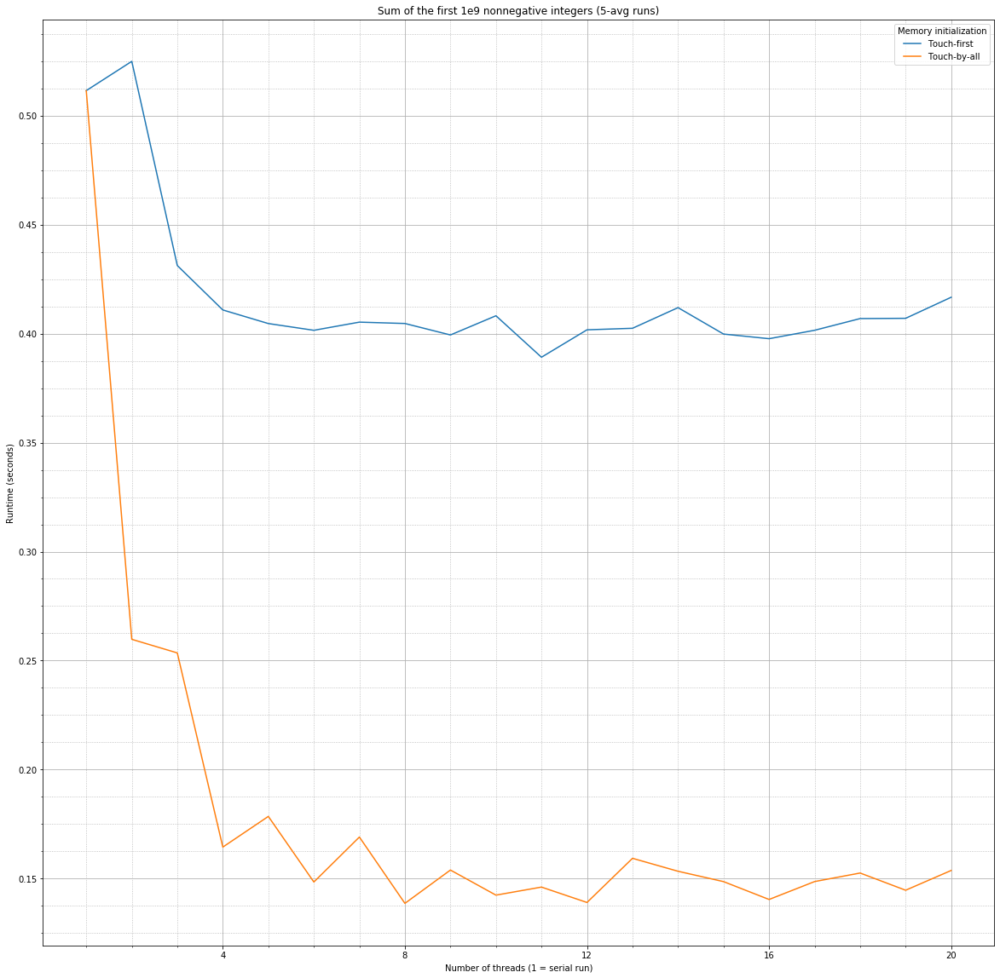
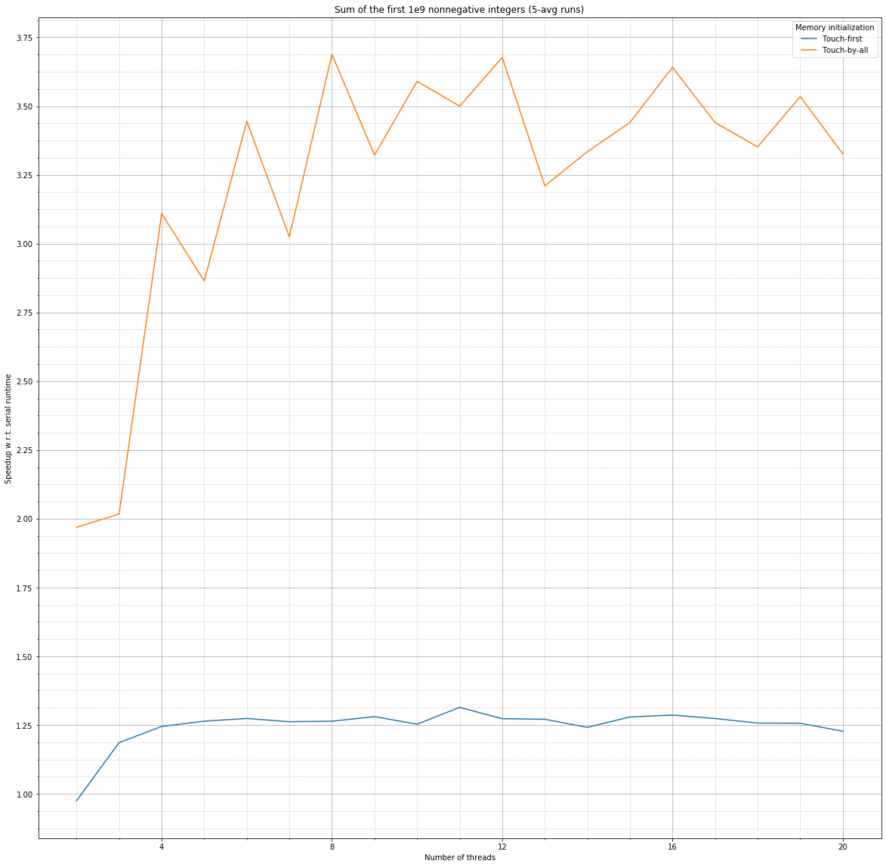
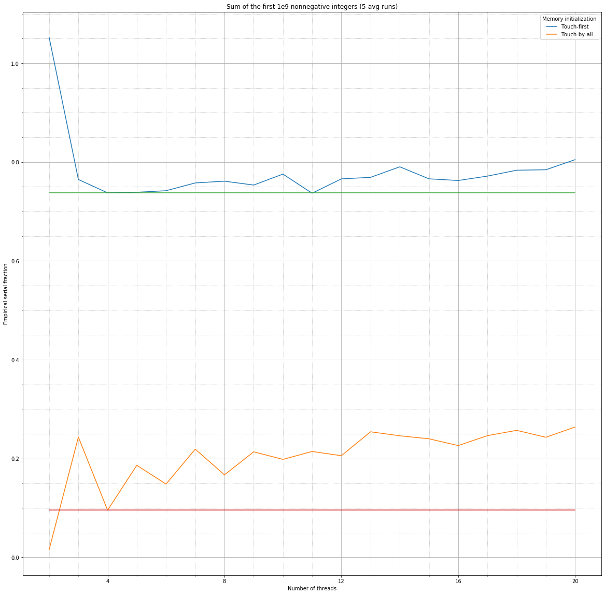
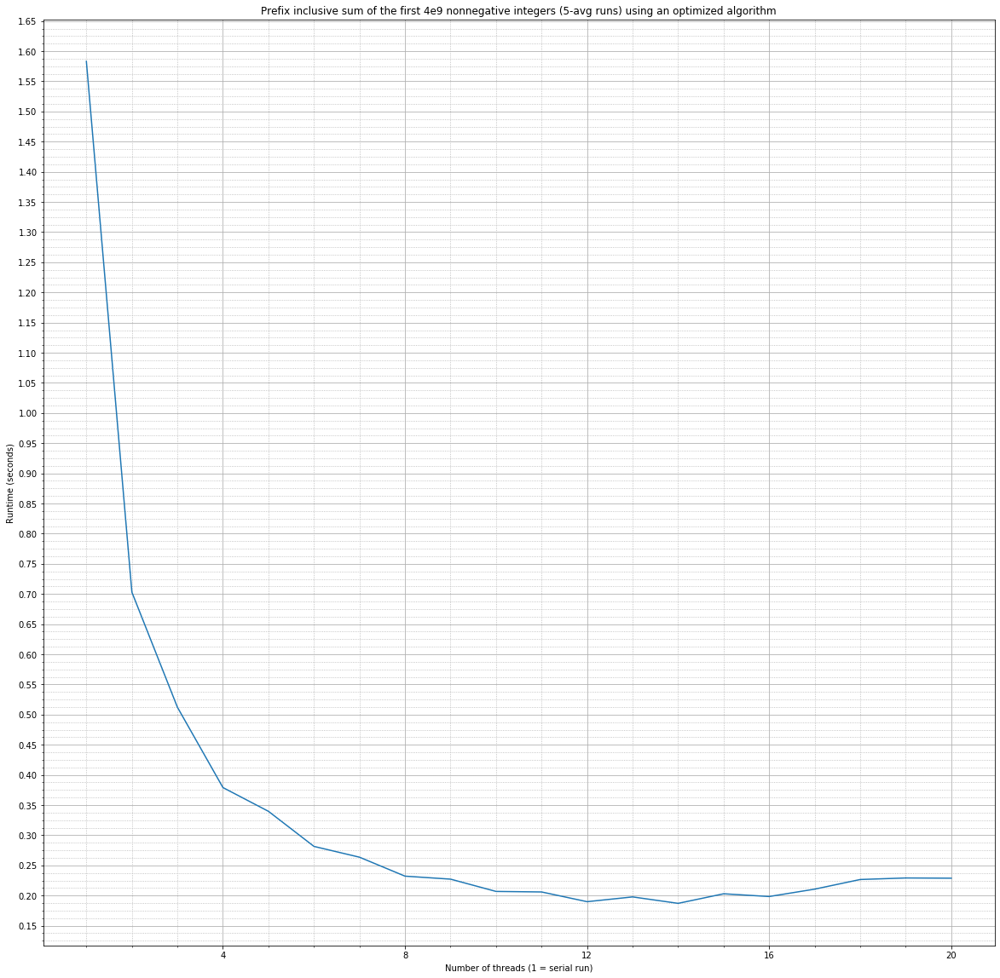
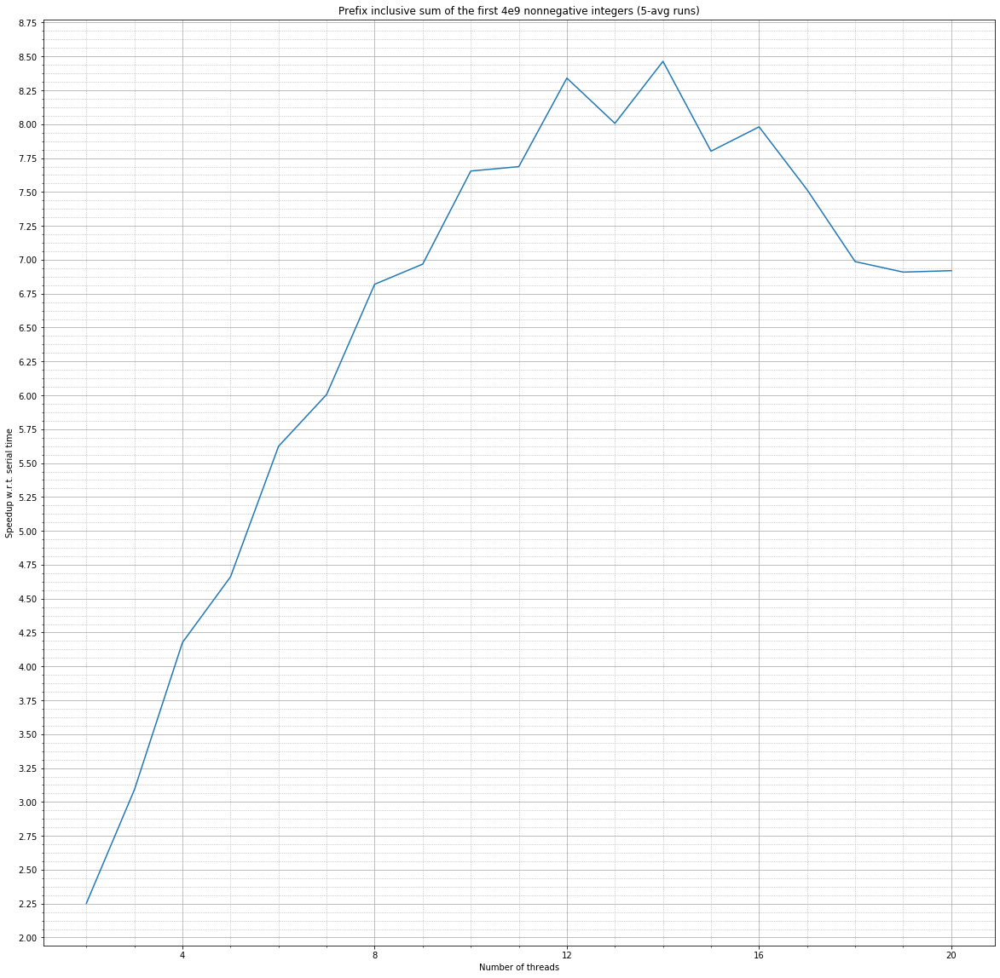
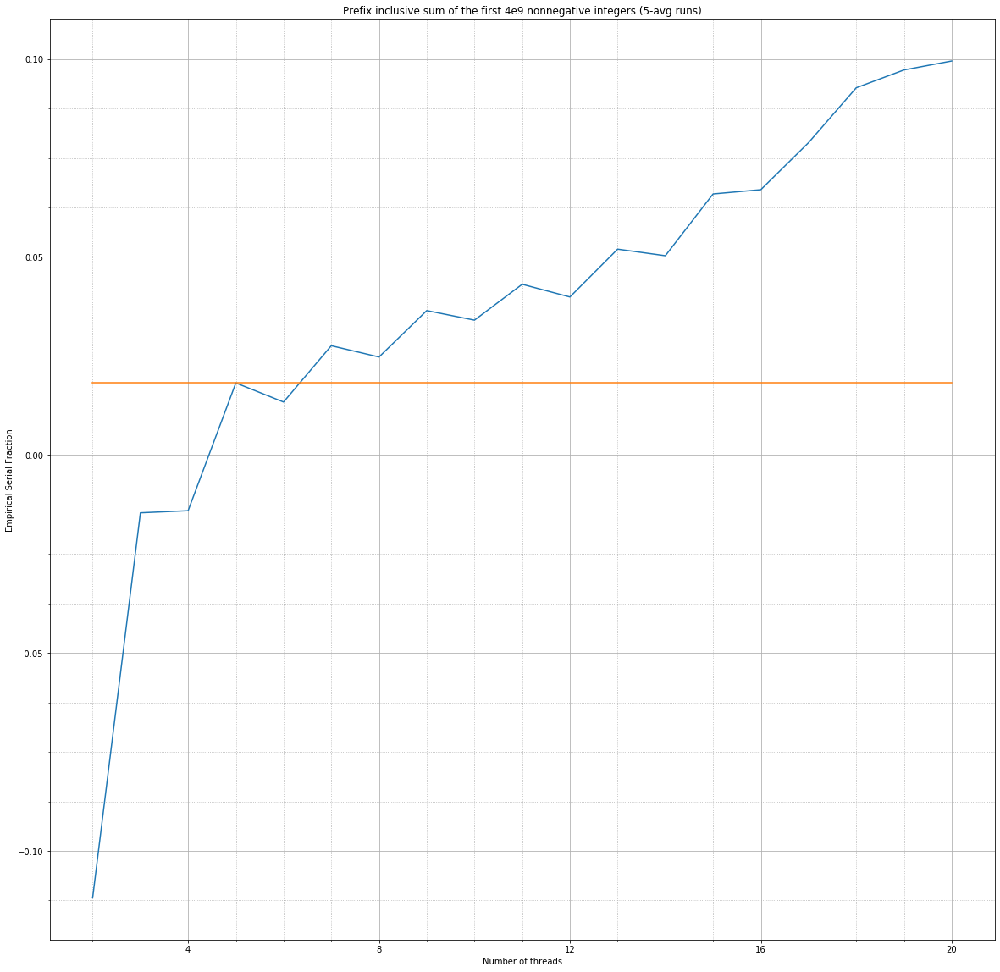

# [2nd Assignment](https://github.com/emaballarin/fhpc_assignments_2019-2020/tree/master/A02) - *FHPC course (2019/‘20)*

### Submitted by: <u>[Emanuele Ballarin](mailto:emanuele@ballarin.cc)</u>

***Tracking [assignment text, version 1](https://github.com/sissa/FHPC_2019-2020/blob/838a9b4757a3992e103539d051416c339dd740eb/Assignements/Assignment02/Assignment02.pdf) (released: 29.11.2019 @ 10.06 CEST)***

The following report, submitted in fulfilment of the requirements for the *Foundations of High Performance Computing* course (academic year 2019/2020), explores the *shared-memory parallel programming* paradigm via the *OpenMP* standard and its compiler-level implementation, together with some of its most remarkable peculiarities.

At first, a comparison is drawn between two C/*OpenMP* codes both implementing the sum of the elements inside an array of fixed (and given) length – one allocating and initialising the input vector memory in one *thread space*, and only afterwards distributing the partial-summing *job* to the other threads; the other allocating the memory in one *thread space* and then initialising the memory and distributing the partial-summing *job* to threads. This comparison allows us to show and study the phenomenon of *touch-first vs touch-by-all* memory initialisation, and its impact on program runtime.

Later, we focus on the problem of *Prefix inclusive sum* as a prototype for the class of *linear scan* problems, which are noteworthy difficult to parallelize in a *work-efficient* fashion. An analysis is performed of the whole process of algorithmic choice, design and implementation for both an efficient serial and parallel version of the algorithm. Relevant performance metrics related to program runtime are also provided.

---

## Section 0: The Tools of the Trade

Given the potential relevance on final results of the specific hardware architecture, the operating system, the choice of tools and the benchmarking environment in performance-sensitive contexts like the present one, this section serves as an attempt at clarifying any of those variables. This should further reproducibility and help in better explaining experimental data and observations.

### 0.1 - Local development

Local development, testing and *micro*benchmarking of the codes, including preliminary profiling, has been performed on a Linux mobile workstation equipped with:

-   a single, stock, *Intel Core i7-6820HQ* (4 cores, hyperthreaded),
-   2100 MHz dual-channel DDR4 RAM (16 GB total) UMA;

running:

-   *Manjaro Linux* 18.1.4,
-   Linux kernel 5.4.3, x86_64 (`SMP PREEMPT`, `FULL_NOHZ`);

and using the following task-related tools:

-   Intel Compilers and Tools (PSXE) 19.0.5.281 (`20190815`) backed by GCC 9.2.0 and LLVM/Clang 9.0.0
-   Intel OpenMP (PSXE) 19.0.5.281 (`20190815`)
-   Perf 5.4 (`5.4.g219d54332a09`)

Except where otherwise noted, no relevant OpenMP- or compiler- related environmental variables have been set globally.

### 0.2 - Remote development / Deployment

Remote development, final testing, profiling and *full* benchmarking has been performed on a standard *legacy partition* node (20 available cores, in total) of the *Ulysses* supercomputing cluster, located at the *SISSA/ICTP Supercomputing Centre*, Trieste, Italy.

Such computational node features:

-   a dual-socket *Intel Xeon  E5-2680 v2* (20 cores total),
-   RAM memory NUMA (2 zones, one per socket);

runs:

-   A customised, stripped-down, *Red Hat*-based GNU/Linux distribution (LSB: `base-4.0-amd64:base-4.0-noarch:core-4.0-amd64:core-4.0-noarch`),
-   Linux kernel 2.6.32, x86_64 

and provides (with some effort) the following task-related tools:

-   Intel Compilers and Tools 18.0.5 (`20180823`) backed by GCC 6.2.0
-   Intel OpenMP 18.0.5 (`20180823`) 
-   Perf 2.6.32 (`2.6.32-431.5.1.el6_lustre.x86_64`)

Except where otherwise noted, no relevant OpenMP- or compiler- related environmental variables have been set globally, except those required to force each *OpenMP* thread to run on one (entire, if available) CPU core. In no case more *OpenMP* software threads than available CPU cores have been used.

Code compilation and linking (see program-specific `README`s or source files for a list of all the relevant flags passed to the compiler), programmatic run of compiled programs and data acquisition have been performed directly on the deployment machine, via a combination of Bash and Python scripts.

Specifically, Bash 4.1.2 (`4.1.2(1)-release (x86_64-redhat-linux-gnu)`) and the Intel Distribution for Python (`Python 3.6.9 :: Intel Corporation`) have been used. However, any bash version $\geq4.0$ and any Python 3 setup supporting the `numpy` and `subprocess` modules should work with no change in the scripts or commands.

---

## Section 1: *Touch-first vs Touch-by-all*

In this section, as anticipated, we compare the implementation and the runtime performance of two shared-memory parallel codes computing the sum of the numbers in an array. One of them uses a *touch-first* approach to memory initialisation, whereas the other uses a *touch-by-all* approach.

### 1.1 - Implementation details

Both the codes used in this section are just slight modifications of the given-ones, which in turn come from the same original implementation with the necessary adaptations required to make the comparison significant (implementing the *touch-first* and *touch-by-all* dynamics). 

The codes are written in *C* and (apart from all the necessary *machinery* required to gather execution times *in-code* and to output the results) require no additional libraries or bindings apart from OpenMP, which is necessary for the parallel version of the code only.

In both the codes – both the serial and the parallel version – a standard *C-array* of *doubles* is allocated, and filled in each position with the (mathematically-speaking) integer number corresponding the index of that position. Afterwards, the array is scanned and the running sum of its numbers is saved into an accumulator. The final value of such accumulator is output by the program.

For the serial version of the code, a simple `for` loop is used to iterate through the array and sum each value to a pre-zeroed accumulator.

For the parallel version, an *OpenMP "+" reduction* is invoked over the elements of the array – given its bounds – and distributed among the available threads.

The relevant differences between the two versions are outlined below.,

#### 1.1.1 - *Touch-first:*

The array is first allocated in memory via a *C*-`malloc` call and then initialised serially, as described. In the case of parallel execution, both these operations happen outside any parallel region.

In the case of parallel execution, the *OpenMP reduction* is performed by all the threads spawned over the pre-initialized array.

#### 1.1.2 - *Touch-by-all:*

The array is first allocated in memory via a *C*-`malloc` call and then initialized serially, as described, only in the case of the serial version.

In the case of parallel execution, a parallel `for` is defined right after allocation in order to perform memory initialization. Being the number of elements of the array known beforehand, each thread is able to initialize its own memory portion of such array. Then, the *OpenMP reduction* is performed by all the threads spawned over the pre-initialized array.

In the assumption that the parallel-`for`-scheduling is maintained the same between the two calls, this realized a *touch-by-all* pattern.

### 1.2 - Theoretical performance implications

Though algorithmically there are no differences between the two implementations, divergences emerge in the way memory is managed by the program during execution, with specific regard to the relationship between threads and memory (the so-called concept of *memory ownership*).

#### 1.2.1 - *Touch-first:*

In the *touch-first* case, the array is initialised by one single thread (the only one present at the beginning, in both the serial and the parallel execution) and, according to *POSIX* specifications:

-   data are stored in the memory page(s) closest to the physical location of the hardware thread such software thread is running on;
-   as a consequence, only that thread-specific cache is warmed up with the data.

When data is needed to be accessed in order to perform the summation in the serial execution, no relevant phenomenon occur, as the same software thread performs the summation serially, thus benefitting from both memory locality and cache warmup.

In the case of parallel execution, instead, these concurrent phaenomena occur:

-   all threads requiring the data – except one – need to access some memory locations which are non-local to them, thus paying in performance due to remote memory access,
-   as a consequence, contention may arise in accessing the aforementioned memory locations, leading to additional performance degradation,
-   lastly, thread-local cache has not been warmed up – except for the same one thread – making it impossible to benefit from cache warmup/locality.

As an overall result, performance is expected to be far from theoretical speedup estimation/guarantees, and definitely improvable. As a consequence, a relevant portion of CPU cycles is wasted in memory access and by cache misses.

#### 1.2.2 - *Touch-by-all:*

In the case of *touch-by-all* memory initialisation during the parallel execution, instead, with the assumption that loop scheduling will remain the same among different calls:

-   the data which each thread will need, afterwards, in the reduction phase are stored in the memory page(s) closest to the physical location of each hardware thread each software thread is running on;
-   each thread-specific cache is warmed up with the data that specific thread will need afterwards (and which contains in memory).

For that reason, when data is needed to be accessed for the reduction:

-   all threads can access required data from memory locations which are physically-local to them,
-   as a consequence, potential contention is greatly reduced or avoided,
-   lastly, thread-local cache has been warmed up with the memory-local data making it possible to exploit caching to speedup access to data.

As an overall result, performance is expected to be greatly improved as compared to the *touch-first* case. As a consequence, the number of instructions-per-cycle during program execution is expected to be remarkably higher in comparison with the *touch-first* case.

### 1.3 - Experimental performance evaluation

For the experimental performance evaluation of the two aforementioned codes, that follows, one parameter is required to be defined by the user: the number $N$ of elements to sum (and their value).

As requested, the value of $N=10^9$ has been taken and the elements to be summed have been fixed (as already said) to the positional ordinal of the array place to be filled with that number.

Plain runtime-taking – for both serial and parallel execution –, speedup calculation and parallel overhead estimation have been performed for both codes in a *strong-scaling* setting. That is: keeping the problem size ($N$ in this case) fixed, while increasing the number of threads dedicated to the task.

Timings are shown in the graph below.

By applying the already-known *parallel speedup* formula $Sp(N,P) = Ts(N)/Tp(N,P)$, it has been possible to compute the *parallel speedup* associated to both codes – in the same runtime as above. Results are shown in the graph below. 

Lastly, the *empirical serial fraction* of the code has been computed. The *e.s.f.* of a parallel code is an attempt to measure empirically – and in an approximate fashion – the overall fraction of time required to run serial parts of the code. As we will see later, this metric can also be put into relationship with *parallel overhead* (or even be considered a measure of it, under certain hypotheses).

The *e.s.f.* of a parallel code can be directly computed from timing data, with the following formula:

$e(N,P) = {{{{1}\over{Sp(N,P)}} - {{1}\over{P}}} \over {{{1}} - {{1}\over{P}}}}$

The following graph shows the *e.s.f.* for both codes, obtained from the runtimes above. Constant lines corresponding to $e(10^9,4)$ for the two codes have also been reported, for reasons which will be clearer later.

### 1.4 - Comments and explanations

By looking at the graphs shown above, the first and foremost conclusion is evident: as explained before – in the theoretical section – the *touch-by-all* approach is indeed by far more efficient and this is reflected by lower timings, higher speedups and lower overheads (estimated by the means of the *e.s.f.*; details on this below) across the whole $P$-space.

Having already explained in detail the reasons that allow this behaviour, we will focus in this section on some *finer* analyses of collected data.

#### 1.4.1 - Early limits to scaling

By looking at either the timings or the speedups, it appears clear that both codes show an early (w.r.t $P$) limit to strong scaling. At $P=3$ (*touch-first*) or $P=4$ (*touch-by-all*) execution times start to diverge from any acceptable approximation of a linear scaling. This can be explained by noting that – not being since the beginning among the priorities of such codes – the implementation is not particularly efficient from an algorithmic point of view. The relatively small value of $N$ (for a summation problem, and taking into account also the fact that modern CPU architectures are particularly optimised for summation in serial execution, especially knowing that the `-Ofast` option used ad compile-time with Intel compilers enables a particularly effective form of automatic loop vectorization), too, can determine an early stop to linear scaling.

#### 1.4.2 - Two-threads parallel runtime of the *touch-first* code

As shown from the graphs before, the parallel running time of the *touch-first* code with $P=2$ is slightly bigger than the serial counterpart. This is evident – too – from the $<1$ speedup. This can be explained by any combination of the following being more relevant than runtime reduction by parallel execution:

-   The fact that such specific run constitutes the first *OMP-parallel* run of the entire data-taking session, thus leading – as empirically notable – to much higher thread-spawning times,
-   The fact that, being it set to `scatter` the default *SW-thread* to *HW-thread*/socket affinity (in order to ensure globally a more balanced memory access time for random thread/memory location), in this run is the most evident the effect of *remote memory access* (both in actual access and at the final reduction step),
-   Statistical noise, though less probable.

#### 1.4.3 - Noise in the data

It is evident that the data took from the parallel execution of the *touch-by-all* code are more subject to noise in comparison to the *touch-first* counterpart.

#### 1.4.4 - *Toothed* behaviour of the speedup (or time) curves

By looking at the timing data above – and this is even clearer from the speedup curves – a curious pattern emerges from the *touch-by-all* execution. Though having a similar mean (particularly after $P=4$ ), runs with an odd number of threads appear to perform worse that the even-$P$ nearest neighbours. This can be explained by the combination of the following – noting also that, due to the very aggressive optimization requested to the compiler – minor factors can become more relevant compared to unoptimized generated machine code:

-   A higher imbalance in memory accesses, given the `scatter` thread initialization default,
-   The fact that – at the reduction phase – vectorization (which is performed at `-Ofast` level) becomes more burdensome for an odd number of elements,
-   Similarly to the above, arithmetic operations for which modern CPUs are optimized (i.e. summation) are binary,
-   The partial inability to perform operation-optimizations based on binary computational graphs at the reduction phase, both at compiler-level and OpenMP-level.

#### 1.4.5 - Parallel overhead

By assuming the *e.s.f* of the codes as a measure of parallel overhead (see appendix below), we can notice that such *parallel overhead* – modulo some outliers – remains almost constant in the *touch-first* case for $P\leq12$ and slightly increases for $P>12$.

In the *touch-by-all* case, a clearly increasing (though slowly) trend can be seen since right after $P=4$. This can be explained by considering that – in the *touch-by-all* case – the much greater *parallel efficiency* of the code makes easier for overhead phenomena to stand out.

### 1.5 - APPENDIX I: On the use of *e.s.f* to estimate *parallel overhead*

In this section, we try to explain why the *e.s.f.* of a parallel code – under some relaxed form of the *Gustafson’s Hypothesis* can be considered to be a good metric for *parallel overhead*.

We start by recalling that it is *ideally possible* to consider the execution time of a given code $Tp(N,P)$ for a problem of given size $N$ and running on $P$ threads as partitioned among $t_p(N,P)$ the execution time resulting from the execution of a perfectly parallelized part and $t_s(N)$ the time coming from the remaining portion of the runtime: $Tp(N,P) = t_s(N) + t_p(N,P)$.

In the framework just outlined, the *e.s.f.* $e(N,P)$ of a code serves as an estimation of $t_s(N) \over {t_s(N) + t_p(N,P)}$ which is indirectly deduced as the *fraction* of the code which does not scale reciprocal-linearly with $P$.

Due to the fact that the portion of the code that produces *parallel overhead* runs in a cumulative time interval duration which does not scale reciprocal-linearly with the number of threads (instead: common overhead models estimate that time duration being linear, logarithmic or log-linear in $P$), its burded is estimated as summed with the *true, algorithmically-serial* portion of the code. That is: $e(N,P) \approx {t_s(N) + t_{oh}(N,P)\over {t_s(N) + t_p(N,P) + t_{oh}(N,P)}} = {t_s(N)\over {t_s(N) + t_p(N,P) + t_{oh}(N,P)}} + {t_{oh}(N,P)\over {t_s(N) + t_p(N,P) + t_{oh}(N,P)}}$.

If we work under the hypothesis that there exist a pair $(\tilde{N},\tilde{P})$ small enough such that ${t_s(N) \over {Tp(N,P)}} \approx \tilde{e}$ for any $P\geq \tilde{P}, N\geq \tilde{N}$, we can rewrite the previous relation as: ${{t_{oh}(N,P)}\over{Tp(N,P)}} \approx {e(N,P) - \tilde{e}}$ for any $N \geq \tilde{N}$. In the graphs shown above, $\tilde{P}$ is assumed to be $4$ and $N$ always $\geq \tilde{N}$.

We have just shown that $e(N,P) \ \ |\ \ N\geq \tilde{N} \ \and \ P\geq \tilde{P} $ has the same behaviour of $t_{oh}\over{Tp}$ (which is a normalized measure of overhead) at any differential order $\geq1$ and – with regards to increments – also at the zeroth order.

What this approach is lacking is a *numerical value* for the *parallel overhead time ratio* for *a given* value of $N$ and $P$. However, it allows to draw comparisons among different codes and among different runs/versions/… of the same code with regards to *parallel overhead*, without the need of additional hypotheses, without the need of complex statistical machinery and only by measuring quantities which are easily obtainable from benchmark runs.

### 1.6 - APPENDIX II: *Proof by Perf*

In order to further check the validity of the theoretical performance explanations outlined in *Section 1.2*, it is possible to use a performance profiler such as the Linux-kernel-integrated *Perf* tool.

Given the age of the available kernel-space tools on a *legacy* Ulysses node, the two most sensible available performance counters to look at, related to the point we are trying to prove are:

-   The *number of instructions per normalized cycle*, that is the ratio between the number of CPU operations executed throughout the whole program execution and the number of reference cycles (that is: which take into account eventual *variable-clock* P-states of the CPU) during the same program execution;
-   The ratio of stalled cycles, that is the ratio of CPU cycles wasted in not performing operations (e.g. waiting for memory access, for data from cache/memory, …) and the total number of cycles; usually reference cycles are taken into account.

Both counters convey the same kind of information – as far as our specific case is concerned.

Knowing that – from the considerations outlined before – the phenomena described are generally independent from $P$ or $N$, being them just sufficiently large, as an example *Instructions per cycle* and *Stalled cycles per instruction* counter values are shown below for the specific pair $P=12$, $N=10^9$. The average of $10$ consecutive runs is considered, both in the *touch-first* and the *touch-by-all* cases, and the percent-error range is specified in parens.

|                     | Instructions per cycle | Stalled cycles per instruction |
| ------------------: | :--------------------: | :----------------------------: |
|  *Touch-first* code |   0.33 ($\pm$0.62%)    |       2.53 ($\pm$1.81%)        |
| *Touch-by-all* code |   0.37 ($\pm$1.58%)    |       2.25 ($\pm$4.91%)        |

This findings are in line with theoretical predictions formulated in the previous sections.

---

## Section 2: *The Prefix (inclusive) Sum*

In this second section, we will describe the problem of the *prefix (inclusive) sum* as a typical *linear (inclusive) scan* problem. Space will be given to problem description and its algorithmic challenges with regards to parallelization, the main implementation details for both the serial and the parallel version, and some methodological considerations with regards to performance optimization. Runtime data related to timings, speedups and *e.s.f.* as a measure for *parallel overhead* are also provided and commented.

### 2.1 - Problem description

A problem description, from both a mathematical and a *computer-science-theoretical* point of view is given in the following.

#### 2.1.1 - Mathematical problem statement

An *inclusive scan*, given a binary right-associative operator $\otimes$, is a well-posed logical/mathematical operation when defined at most over the space of variable (but nonnegative integer, finite) length vectors (of any dimension $n$),$\ V^n$ , such that ${\otimes}$ is well-defined between any two elements of $V^n$.  Being $V^n$ such vector space satisfying the well-posedness hypothesis for the $\otimes$-scan, and being  $[x_0, x_1, \dots, x_{n-1}] \in V^n$, such definition holds: ${Scan_{\otimes}}([x_0, x_1, \dots, x_{n-1}]) \ = \ {\left[ x_0, \left(x_0\otimes x_1\right),\ldots,\left(x_0 \otimes x_1\otimes\ldots\otimes x_{n-1}\right)\right]}$.

In the particular case in which $\otimes := +$, the operation is called *prefix (inclusive) sum*.

#### 2.1.2 - *Computer-science-theoretical* implications

Such kind of general patterns, for different kinds of specific operators and adequate vector spaces, constitute an important part of the *algorithmic toolbox* required in many different areas at the heart of computer science and modern software engineering.

The most remarkable property of such patterns (in the case of a *state-serial* execution) is the linear time-complexity of any sensible algorithm implementing them, with respect to the number of elements of the input vector, being it constant the execution time of the algorithm implementing $\otimes$ between any pair of elements for which $\otimes$ is algorithmically defined.

This property is inherently linked to the actual way the scan is algorithmically performed:

-   The first element of the output vector is the first element of the input vector,
-   The $i$-th element of the output vector is given by the $\otimes$ operation between the $i-1$-th element of the output vector (which has been calculated at the previous step) and the $i$-th element of the input vector.

The number of operations performed is thus given by $n-1$ for any vector of length $n$. Such number of operations constitutes also the lower theoretical limit to the number of operations required to perform such a scan, making *linear scan* algorithms *work efficient*.

What constitutes one of the main advantages of *scan* algorithms (dubbed also, indeed, *linear scan* algorithms), however, can represent their curse, especially when trying to parallelize their execution. In fact, in order to compute the output of the $i$-th iteration of the algorithm the knowledge of the output of the $i-1$-th is always required, thus making *loop-parallelization* totally ineffective in such cases.

### 2.2 - Algorithmic design choices and optimization methodology

We implemented, as requested, both a serial and a parallel version of the *prefix sum*. The specific instances of the algorithms adopted in the analysis that follows are outlined below.

#### 2.2.1 - Serial algorithm: not a matter of choice

As far as the serial implementation is concerned, we opted for a standard *loop-based* state-sequential algorithm. The number of operations required is the same as the theoretical lower bound, making impossible other algorithmic optimizations.

#### 2.2.2 - Parallel algorithm: *Prefix sum*s for the *Real World*

Being the parallel implementation of the *prefix sum* to be performed according to the *shared memory* paradigm, the obvious algorithmic choice in such case has been the *Blelloch Scan Algorithm*, as outlined in the acclaimed 1993 publication *Prefix Sums and Their Applications* by Prof. Guy E. Blelloch.

This algorithm satisfies the work-efficiency property – in all cases in which memory access time is supposed to be negligible or uniform – for the problem of fruitfully performing a *scan* over $N$ elements and $P$ threads, being $N \gt P$.

The algorithm is remarkably simple, but effective:

-   The input array is partitioned in $P$ contiguous ordered subarrays of an equal (or the closest to that) number of elements,
-   For any of these subarrays, a thread each, a serial *scan* is performed and results are stored in the to-be output array,
-   To any output array element it is summed the last element of every previous subarray.

The last point of the algorithm can be reformulated as:

-   The last element of every ordered subarray is saved (in an orderly fashion) in a *service-array* of dimension $P$,
-   The *scan* of such *service array* is performed serially (or, if reasonable, with an adequate number of threads, by recursion),
-   The $i$-th element of the output of such *scan* is summed to every element of the $i$-th subarray, in according to order.

#### 2.2.3 - Choosing the right metric to optimize

After having determined which algorithm to implement, we are left with the task of converting such algorithm into code. Here is where all the *real world*, code-related, optimizations come into place – and this is what at the end makes the difference.

In our case, we organized our optimization efforts following two leading principles:

-   **The *(micro)benchmark everything* approach:** in evaluating any implementation choice or detail, we either relied on performance guarantees offered by a strict standard-compliance of the programming language and compiler of choice; or we performed a microbenchmark of the different choices, choosing that which lead to the shorter execution time. The entire list of microbenchmarking attempts *lived* sequentially inside a scratchpad file and has not been preserved. 

    When the first working implementation became available – after having checked for correctness – any still-open or still-changeable choices have been re-evaluated with the same goal. At this phase, no compiler-specific *aid* had been used.

    Lastly, a composition of preprocessor- and compiler- related options potentially offering performance benefits has been taken into consideration.

-   **The *unique-serial* approach:** the serial calls to the *prefix sum* operation over an array – in both the serial code itself and the thread-serial *scan* inside the parallel implementation – have to be calls to the same function.

    This allows the thread-serial calls to benefit from the same optimizations as the serial version of the code, while avoiding overblown speedups due to a highly-inefficient serial implementation of the code which is then refined inside the parallel implementation.

    In our specific case, no design choice for the parallel version of the code have been made before having finalized the development of the serial version of it.

### 2.3 - Actual implementation details

Bearing in mind the oldtime *hacker motto* according to which *source code is the ultimate manpage*, the following subsection is just an attempt at clarifying the most obscure, debatable, nonobvious parts of the code.

#### 2.3.1 - Mind your language!

The programming language of choice was *C++17*, as a way to blend the ability to memory-manage at a low level and offer a whole lot of compiler optimizations, together with high-level no-overhead constructs which are resolved at compile-time and offer better safety and/or practicality (i.e. templates, the `auto` keyword, pointer-references, …).

#### 2.3.2 – General outlook & Serial implementation

Generally-speaking, the implementation has been kept as close to memory as possible, and as operations-parsimonious as possible. This has been done in order to reduce at minimum useless operations and to give the compiler too a *clear picture* of the execution workflow.

In particular:

-   Code execution has been made input-independent for the final benchmark. A *walled garden* approach has been chosen. During development and correctness verification different kind of tests have been performed referring to typical execution. After that – enabled with a peculiar `#define` – even the number of elements of the input array to be filled has been hardcoded via a `constexpr`;
-   Templates have been chosen as a way to enforce compile-time polymorphysm, without performance impact.
-   Conditional instruction-branching in the performance-critical code has been avoided altogether. Where strictly needed, eval-conditionals have been used in the form of boolean expressions casted to integers;
-   Intel-specific library `<aligned_new>` has been used as a form of performance enhancement. The library works by overloading calls to `new()` with respective memory-aligned ones. This trades off some more memory footprint (due to sparser packing) for some improved access times to memory and cache. The alignment is applied only when needed and to the optimal amout for the specific platform. The detection mechanism is the same used by compiler option `-xHost`;
-   A non-in-place approach has been chosen, as a way to clarify the computational graph to the compiler (and the user, too). Every possible constant values/pointers have been `const`-ified;
-   Explicit type casting has been performed wherever possible;
-   The use of the pre-increment operator has been preferred to that of the post-increment to avoid unnecessary memory copying;
-   Integer counters have been defined as unsigned and their type limited to a reasonable upper limit of iterations. Arithmetic have been performed on floating-point types wherever possible, to better exploit compiler and CPU optimizations;
-   Functions have been always inlined;

The list above includes fully the specific optimizations performed on the serial version of the code.

#### 2.3.3 - Parallel implementation

Some relevant details of the parallel implementation of the code are the following:

-   Though the code has been developed for and run for a given vector which is pre-allocated and pre-initialized in memory before the function is called, a `#define` can be passed as a way to produce the *touch-by-all* pattern. Though, being it not its first priority, code has been adapted to this goal only after development. The computational intensity of the runtime has been maintained the same, though the *touch-by-all* execution does not (purposefully) return the right results and is thought to be used only for benchmarking purposes;
-   OpenMP-parallel code has been entirely put into a *closely-packed* `parallel section` in order to avoid *thread-spawning lags* and *split/join lags* typical of fragmented parallelism;
-   The use of `single` thread execution (preferred to `master`) has been used only when strictly needed. The same holds true for the use of `barrier`s. 

#### 2.3.4 - Some *compiler craze* and *`#pragma` magic*

In order to further push-forward the performance of the code, the *Intel Compiler `icpc`* has been exploited, mainly by means of:

-   A long, hand-picked compile line to enable aggressive optimizations, partial loop unrolling, and disable runtime checks in the compiled code which have already been performed at the development phase;
-   The use of the  Intel-specific `#pragma parallel` which – if used not together with `#pragma vector`, `#pragma ivdep` or the deprecated `#pragma simd` can be used to force a particularly effective form of automatic vectorization in loops. This trick – together to clear loop writing – actually was able to produce *AVX2*-vectorized for all loops, even those with some data dependencies, with no side effect.

#### 2.3.5 - Conclusive remarks

Due to the aforementioned design choices, code execution times are expected to be much lower in the case of the parallel version. However, the exact anatomy of the scaling has to be obtained experimentally.

### 2.4 - Experimental performance evaluation

For experimental performance evaluation of the serial and the parallel codes, with emphasis on the latter, the usual graphs of *runtime*, *parallel speedup* and *e.s.f.* as a measure of overhead will be shown without further ado.

It is important to rafrain the fact that the following graphs refer to benchmarks of the code compiled without the trick required to produce the *touch-by-all* pattern. The OpenMP environment variable governing default *SWthreads*/*cores* assignment has been set to `close`.

### 2.5 - Comments and explanations

From the analysis of the graphs shown above, it appears clear that the parallelization of the code, as expected, was pretty successful. Almost-linear speedup is obtained until $P=12$ and the maximum is reached at $P=14$. Afterwards, as the work-inefficiency of the *Blelloch Algorithm* (though work-efficient for the problem of *parallel* prefix sum) if compared with *serial linear search* for a high number of threads and an ever-growing *parallel overhead* determine a slight increase and a subsequent plateauing of timings and speedups. Maximum speedup (as said, for $P=14$ ) is equal to $\approx 8.5$ .

A *finer* analysis of observed effects is performed below. Given the fact that the performance metrics chosen are the same as those of the *cumulative sum* described and analyzed in the previous sections, many theoretical explanations have already been given and will be omitted for the sake of brevity.

#### 2.5.1 - *Toothed* behaviour of the speedup (or time) curves

The phenomenon is the same as that described in section *1.4.4* and happens for the same reasons.

#### 2.5.2 - Superlinearity in scaling for $2\leq P \leq 4$

The effect is the consequence of the `close` default *SWthreads*/*cores* assignment interplaying with the clever Intel compiler-optimized mixing of memory/cache locality awareness by the means of both L3 cache sharing and exploitation of a/some idle memory bus(es) connected to the same socket. Such effects are not present with the use of a moderately old GCC or LLVM compiler and vanish when the number of threads/cores is $>4$.

#### 2.5.3 - Overhead analysis

By the already explained means of *e.s.f* of the code we can analyze the trend in *parallel overhead*.

For values of $P\leq 4$, as already explained, we observe superlinear speedup scaling and this is reflected by a *non-physical* negative *e.s.f.*.

For values of $P>4$ the *e.s.f.* grows linearly until $P=15$ where it starts to grow in a fashion similar to *logarithmic* or *log-linear* growth. This is in accordance to general empirical consensus and reflects the increased work-inefficiency of parallel *scans* together with intrinsic *OpenMP overhead*.

Such considerations also serve as an explanation to the increasing relevance of *parallel overhead* in slowing scaling for higher values of $P$.

#### 2.5.4 - Early limits to scaling

See beginning of this subsection.